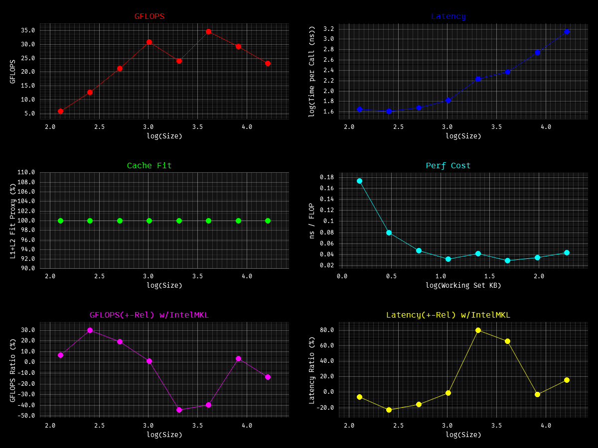
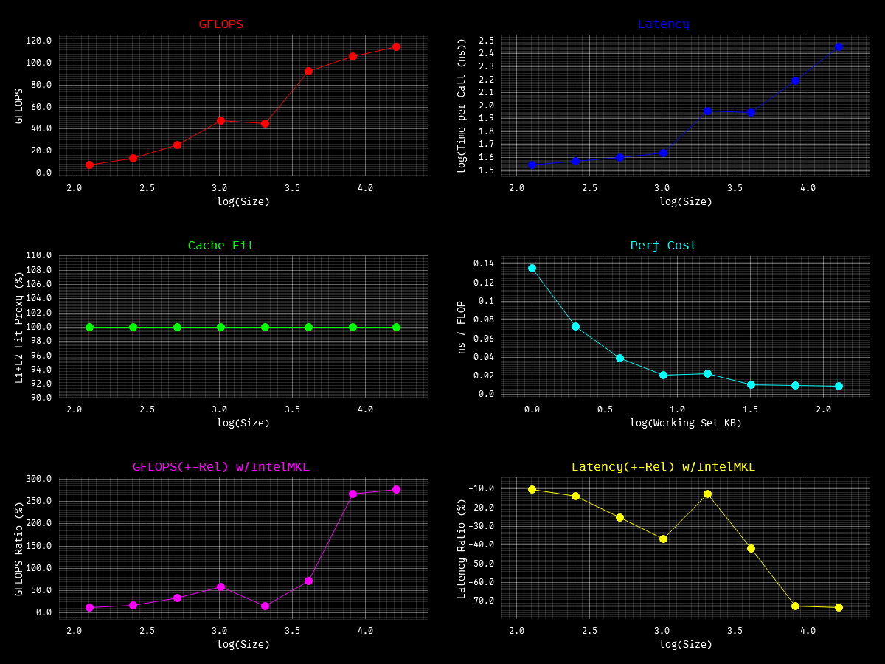
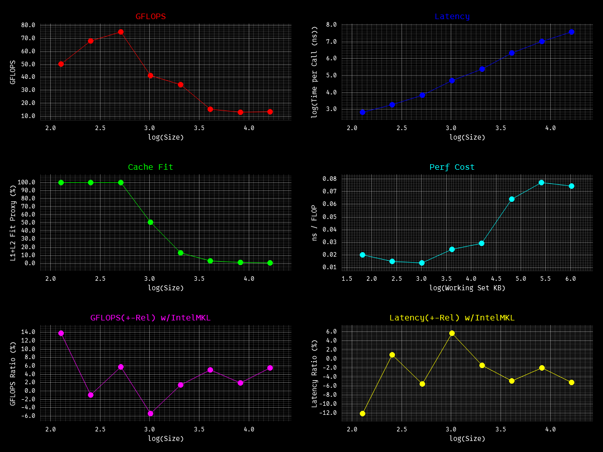
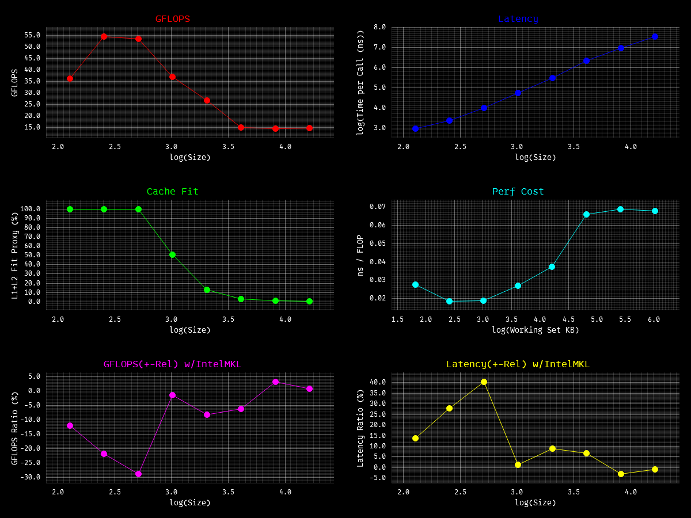
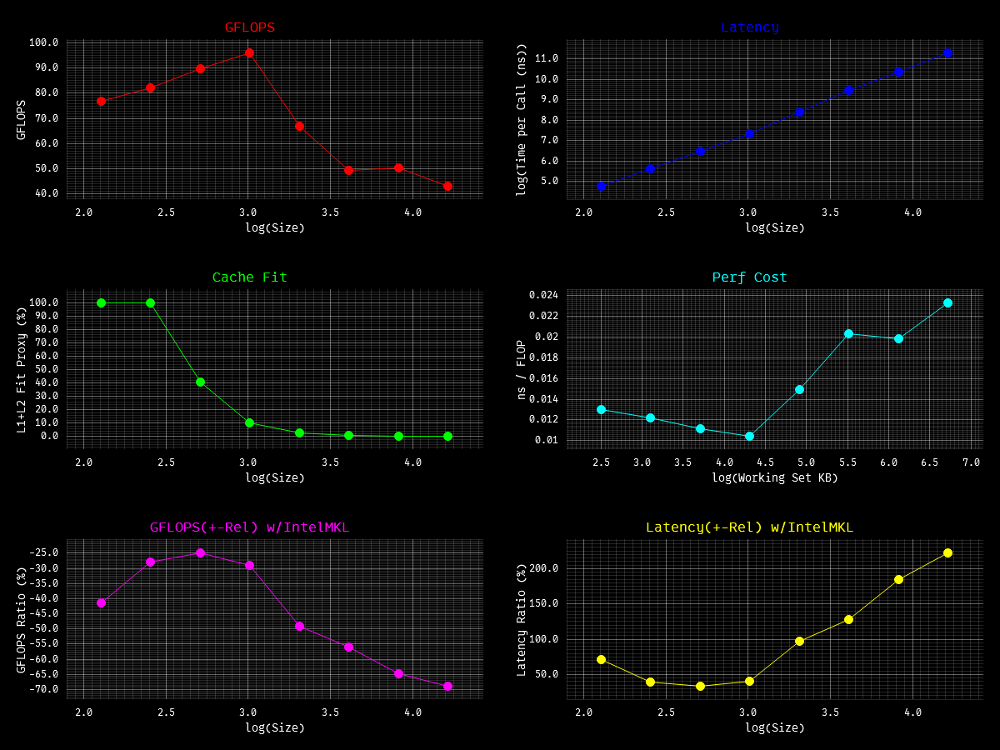

Rookie attempt to rewriting **BLAS FORTRAN 77** and **Intel Math Library** Kernels in modern rust. `ONLY x86_64`

> This will not cover all kernels for every single routine, but the most commonly used ones, (excluding complex
> type and only fp32) and I have **spammed** `_mm256*` intrinsics for all kernels, because I got I7 14650hx which does
> not support AVX-512 :( and lastly, this project is purely for learning source, the code is well written & documented,
> and I will add asm snippet [here](asm) for specific kernel & more refs for better understanding about rustc, x86, HPC
> and perf engineering.

refs I took:

- https://www.netlib.org/blas/ ← good for overview
- https://www.netlib.org/lapack/explore-html/ ←/
- https://icl.utk.edu/~mgates3/docs/lapack.html ←/
- https://www.intel.com/content/www/us/en/docs/onemkl/developer-reference-dpcpp/2025-2/blas-routines.html ← good
  details, very clear
- https://www.intel.com/content/www/us/en/docs/intrinsics-guide/index.html ← good man for intrinsics
- https://doc.rust-lang.org/core/arch/x86_64/index.html#functions ←/
- https://public.dhe.ibm.com/software/dw/cell/BLAS_Prog_Guide_API_v3.1.pdf <- api ref, mostly similar everywhere

TODO:

- lvl1: rotmg, rotm
- lvl2: gemv - all
- lvl3: gemm - all
- handle NaN, over/underflow, return vs panic and many more edge cases :(
- test code ref from [this](https://github.com/OpenMathLib/OpenBLAS/tree/develop) repo, currently ai-generated
- multithreading, GPU maybe?
- LESS BRANCHING, more SIMD, LESS FN CALLS, better DATA_READ, better CACHE
- MAKE GEMV & GEMM FAST FOR ALL PATHS!!!
- bench is somewhat UNFAIR AND NOT UNIFORM

To bench, run **[harness](./bench/bencher.rs)** using
`cargo bench --bench bencher <kernel> or all` [ref](https://github.com/OpenMathLib/OpenBLAS/tree/develop/benchmark) and
build using `RUSTFLAGS target-cpu=x86-64-v3`, otherwise rustc will throw error.

Install [Intel oneAPI Toolkit](https://www.intel.com/content/www/us/en/developer/tools/oneapi/oneapi-toolkit-download.html?packages=oneapi-toolkit&oneapi-toolkit-os=linux&oneapi-lin=offline)
then copy the `.dll` or `.so` into the project root:
windows - `Copy-Item "C:\Program Files (x86)\Intel\oneAPI\compiler\2026.0\bin\libiomp5md.dll" .`
linux - `cp /opt/intel/oneapi/compiler/latest/lib/libiomp5.so .`

> all are single threaded!!! ran on i7 14650hx, rust 1.96.0.

**axpy**

**dot**

**gemv**

**gemv_t**

**gemm_f_f**
