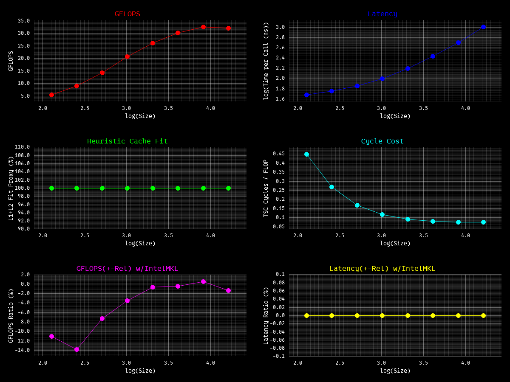
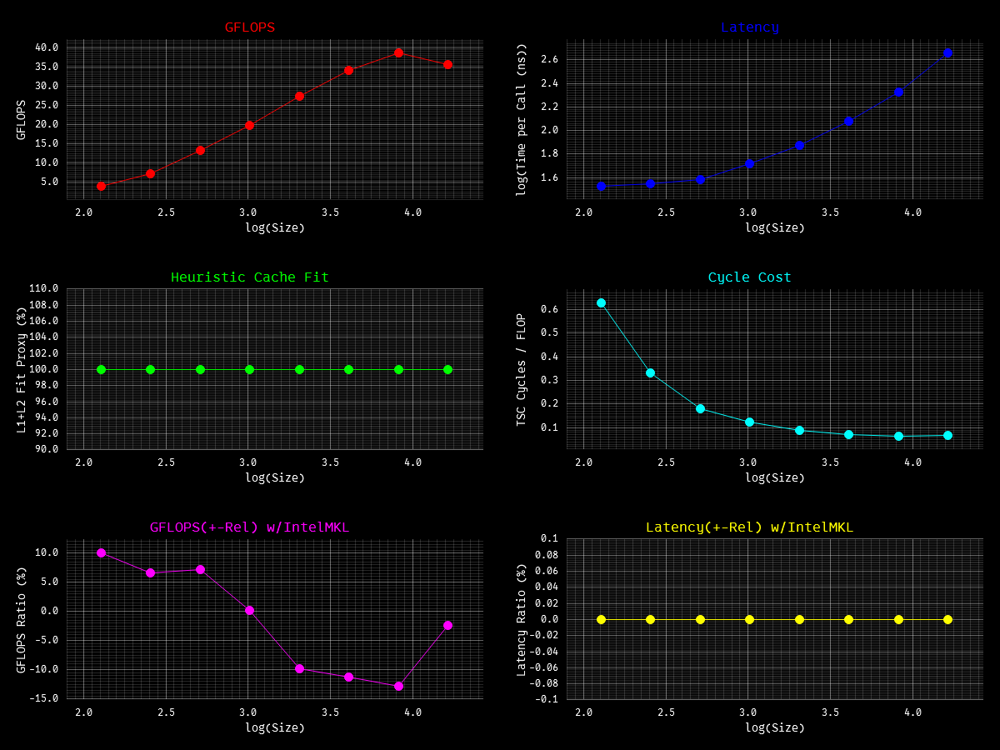
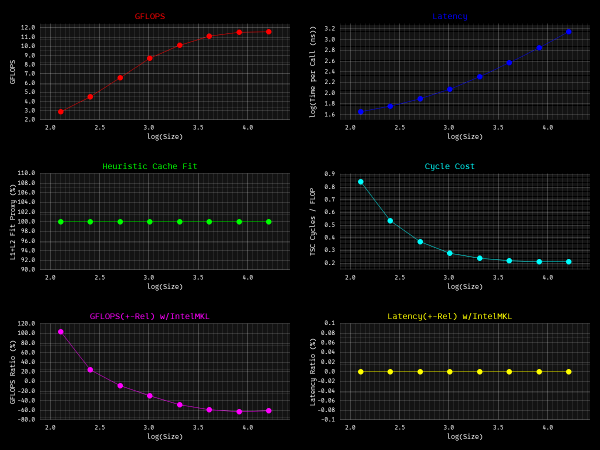

**BLAS FORTRAN 77** and **Intel Math Library** Kernels in modern native rust. `ONLY x86_64`

refs I took:

- https://www.netlib.org/blas/ ← good for overview
- https://www.netlib.org/lapack/explore-html/ ←/
- https://icl.utk.edu/~mgates3/docs/lapack.html ←/
- https://suif.stanford.edu/papers/lam-asplos91.pdf  <- good for understanding cache blocking techniques & optimizations
- https://www.intel.com/content/www/us/en/docs/onemkl/developer-reference-dpcpp/2025-2/blas-routines.html ← good
  details, very clear
- https://www.intel.com/content/www/us/en/docs/intrinsics-guide/index.html ← good man for intrinsics
- https://doc.rust-lang.org/core/arch/x86_64/index.html#functions ←/
- https://public.dhe.ibm.com/software/dw/cell/BLAS_Prog_Guide_API_v3.1.pdf <- api ref, mostly similar everywhere

TODO:

- lvl1: rotmg, rotm
- lvl2: gemv - all
- lvl3: gemm - all
- handle NaN, over/underflow, return vs panic and many more edge cases :(
- test code ref from [this](https://github.com/OpenMathLib/OpenBLAS/tree/develop) repo, currently ai-generated
- multithreading, GPU maybe (NOT CUDA)?
- LESS BAD BRANCHING, more SIMD, LESS FN CALLS, better DATA_READ, better CACHE
- MAKE GEMV & GEMM FAST FOR ALL PATHS!!!
- bench is somewhat UNFAIR AND NOT UNIFORM

To bench, run **[harness](bench/main.rs)** using
`cargo bench --bench main --- <kernel1> <kernel2> ...` [ref](https://github.com/OpenMathLib/OpenBLAS/tree/develop/benchmark)
and build using `RUSTFLAGS target-cpu=x86-64-v3`, otherwise rustc will throw error. Or use `Intel Vtune/Advisor`

Install [Intel oneAPI Toolkit](https://www.intel.com/content/www/us/en/developer/tools/oneapi/oneapi-toolkit-download.html?packages=oneapi-toolkit&oneapi-toolkit-os=linux&oneapi-lin=offline)
then copy the `.dll` or `.so` into the project root:

- windows > `Copy-Item "C:\Program Files (x86)\Intel\oneAPI\compiler\2026.0\bin\libiomp5md.dll" .`
- linux > `cp /home/ronakgh97/intel/oneapi/compiler/latest/lib/libiomp5.so .`
- mac > `sell that bullshit`

> All are single threaded, ran on i7 14650hx, rust 1.97.1, last updated on 08/20/2026

**AXPY**

| Size  | Run      | GFLOPS  | %GFLOPS   | %Latency  | WSS Cache | Cyc/Flop |
|-------|----------|---------|-----------|-----------|-----------|----------|
| 128   | 58524151 | 7.4911  | +11.3976% | -10.2315% | 100.00%   | 0.3229   |
| 256   | 55360685 | 14.1723 | +10.1577% | -9.2210%  | 100.00%   | 0.1707   |
| 512   | 49054090 | 25.1157 | +22.3982% | -18.2994% | 100.00%   | 0.0963   |
| 1024  | 29526357 | 30.2350 | -22.3954% | +28.8583% | 100.00%   | 0.0800   |
| 2048  | 15931282 | 32.6273 | -35.6184% | +55.3238% | 100.00%   | 0.0741   |
| 4096  | 9392704  | 38.4725 | -31.0237% | +44.9773% | 100.00%   | 0.0629   |
| 8192  | 3618502  | 29.6428 | +1.8525%  | -1.8188%  | 100.00%   | 0.0816   |
| 16384 | 1740415  | 28.5149 | -0.4081%  | +0.4098%  | 100.00%   | 0.0848   |

**DOT**

| Size  | Run      | GFLOPS   | %GFLOPS    | %Latency  | WSS Cache | Cyc/Flop |
|-------|----------|----------|------------|-----------|-----------|----------|
| 128   | 62846043 | 8.0443   | +16.1387%  | -13.8961% | 100.00%   | 0.3007   |
| 256   | 61807547 | 15.8227  | +19.8706%  | -16.5767% | 100.00%   | 0.1529   |
| 512   | 59659094 | 30.5455  | +37.8536%  | -27.4593% | 100.00%   | 0.0792   |
| 1024  | 57196195 | 58.5689  | +89.1212%  | -47.1239% | 100.00%   | 0.0413   |
| 2048  | 51153016 | 104.7614 | +129.0941% | -56.3498% | 100.00%   | 0.0231   |
| 4096  | 40504206 | 165.9052 | +243.2078% | -70.8631% | 100.00%   | 0.0146   |
| 8192  | 28652045 | 234.7176 | +726.7281% | -87.9041% | 100.00%   | 0.0103   |
| 16384 | 18024791 | 295.3182 | +602.2187% | -85.7594% | 100.00%   | 0.0082   |

**NRM2**

| Size  | Run      | GFLOPS  | %GFLOPS   | %Latency  | WSS Cache | Cyc/Flop |
|-------|----------|---------|-----------|-----------|-----------|----------|
| 128   | 42089412 | 5.3874  | -11.0229% | +12.3885% | 100.00%   | 0.4490   |
| 256   | 35079135 | 8.9803  | -13.8755% | +16.1110% | 100.00%   | 0.2694   |
| 512   | 27980944 | 14.3262 | -7.2883%  | +7.8612%  | 100.00%   | 0.1689   |
| 1024  | 20163996 | 20.6479 | -3.5163%  | +3.6445%  | 100.00%   | 0.1172   |
| 2048  | 12802602 | 26.2197 | -0.6175%  | +0.6214%  | 100.00%   | 0.0923   |
| 4096  | 7366935  | 30.1750 | -0.4413%  | +0.4433%  | 100.00%   | 0.0802   |
| 8192  | 3987749  | 32.6676 | +0.5686%  | -0.5654%  | 100.00%   | 0.0741   |
| 16384 | 1960388  | 32.1190 | -1.3995%  | +1.4194%  | 100.00%   | 0.0753   |

**ASUM**

| Size  | Run      | GFLOPS  | %GFLOPS   | %Latency  | WSS Cache | Cyc/Flop |
|-------|----------|---------|-----------|-----------|-----------|----------|
| 128   | 60014248 | 3.8409  | +10.1060% | -9.1784%  | 100.00%   | 0.6299   |
| 256   | 56734936 | 7.2621  | +6.6010%  | -6.1923%  | 100.00%   | 0.3331   |
| 512   | 52214053 | 13.3668 | +7.2522%  | -6.7618%  | 100.00%   | 0.1810   |
| 1024  | 38650881 | 19.7893 | +0.2326%  | -0.2321%  | 100.00%   | 0.1222   |
| 2048  | 26789160 | 27.4321 | -9.8139%  | +10.8818% | 100.00%   | 0.0882   |
| 4096  | 16671274 | 34.1428 | -11.1818% | +12.5895% | 100.00%   | 0.0709   |
| 8192  | 9463469  | 38.7624 | -12.8816% | +14.7863% | 100.00%   | 0.0624   |
| 16384 | 4352208  | 35.6533 | -2.3183%  | +2.3733%  | 100.00%   | 0.0679   |

**I_AMAX**

| Size  | Run      | GFLOPS  | %GFLOPS    | %Latency   | WSS Cache | Cyc/Flop |
|-------|----------|---------|------------|------------|-----------|----------|
| 128   | 44813279 | 2.8680  | +104.0533% | -50.9932%  | 100.00%   | 0.8435   |
| 256   | 35397197 | 4.5308  | +24.0493%  | -19.3869%  | 100.00%   | 0.5339   |
| 512   | 25642587 | 6.5645  | -8.3386%   | +9.0972%   | 100.00%   | 0.3685   |
| 1024  | 16961667 | 8.6844  | -29.5496%  | +41.9438%  | 100.00%   | 0.2786   |
| 2048  | 9902440  | 10.1401 | -48.3213%  | +93.5032%  | 100.00%   | 0.2386   |
| 4096  | 5414404  | 11.0887 | -59.1860%  | +145.0143% | 100.00%   | 0.2182   |
| 8192  | 2816718  | 11.5373 | -63.4438%  | +173.5515% | 100.00%   | 0.2097   |
| 16384 | 1417568  | 11.6127 | -61.0205%  | +156.5450% | 100.00%   | 0.2083   |

**GEMV**

| Size  | Run     | GFLOPS  | %GFLOPS   | %Latency  | WSS Cache | Cyc/Flop |
|-------|---------|---------|-----------|-----------|-----------|----------|
| 128   | 3241362 | 53.1001 | -12.8399% | +14.7314% | 100.00%   | 0.0456   |
| 256   | 1084617 | 71.0814 | +0.6962%  | -0.6914%  | 100.00%   | 0.0340   |
| 512   | 268098  | 70.2802 | -3.6030%  | +3.7377%  | 100.00%   | 0.0344   |
| 1024  | 34432   | 36.1040 | -1.4569%  | +1.4785%  | 51.02%    | 0.0670   |
| 2048  | 8257    | 34.6324 | -0.5891%  | +0.5926%  | 12.77%    | 0.0699   |
| 4096  | 1132    | 18.9895 | +1.6010%  | -1.5758%  | 3.20%     | 0.1274   |
| 8192  | 247     | 16.5505 | +2.9944%  | -2.9073%  | 0.80%     | 0.1462   |
| 16384 | 61      | 16.3223 | +3.2493%  | -3.1471%  | 0.20%     | 0.1482   |

**GEMV_T**

| Size  | Run     | GFLOPS  | %GFLOPS  | %Latency | WSS Cache | Cyc/Flop |
|-------|---------|---------|----------|----------|-----------|----------|
| 128   | 4248004 | 69.5993 | +8.3940% | -7.7440% | 100.00%   | 0.0348   |
| 256   | 1127538 | 73.8943 | +3.6890% | -3.5578% | 100.00%   | 0.0327   |
| 512   | 277109  | 72.6423 | +1.1904% | -1.1764% | 100.00%   | 0.0333   |
| 1024  | 33823   | 35.4653 | -4.1473% | +4.3268% | 51.02%    | 0.0682   |
| 2048  | 8617    | 36.1379 | +3.3661% | -3.2565% | 12.77%    | 0.0669   |
| 4096  | 1150    | 19.2773 | -0.3482% | +0.3495% | 3.20%     | 0.1255   |
| 8192  | 242     | 16.1827 | -0.6822% | +0.6868% | 0.80%     | 0.1495   |
| 16384 | 61      | 16.2154 | -0.6713% | +0.6759% | 0.20%     | 0.1492   |

**GEMM_F_F**

| Size  | Run   | GFLOPS   | %GFLOPS   | %Latency   | WSS Cache | Cyc/Flop |
|-------|-------|----------|-----------|------------|-----------|----------|
| 128   | 39717 | 83.2920  | -30.2797% | +43.4303%  | 100.00%   | 0.0290   |
| 256   | 5760  | 96.6350  | -23.8780% | +31.3680%  | 100.00%   | 0.0250   |
| 512   | 831   | 111.4461 | -14.0646% | +16.3665%  | 40.94%    | 0.0217   |
| 1024  | 93    | 98.9104  | -23.8761% | +31.3648%  | 10.23%    | 0.0245   |
| 2048  | 11    | 87.4882  | -32.8669% | +48.9577%  | 2.56%     | 0.0277   |
| 4096  | 1     | 56.8975  | -56.9288% | +132.1735% | 0.64%     | 0.0425   |
| 8192  | 1     | 52.1073  | -60.8331% | +155.3175% | 0.16%     | 0.0464   |
| 16384 | 1     | 51.7685  | -61.3525% | +158.7488% | 0.04%     | 0.0467   |

Wanna improve the [bench](bench/main.rs) and added more kernels perf test? Send me a PR